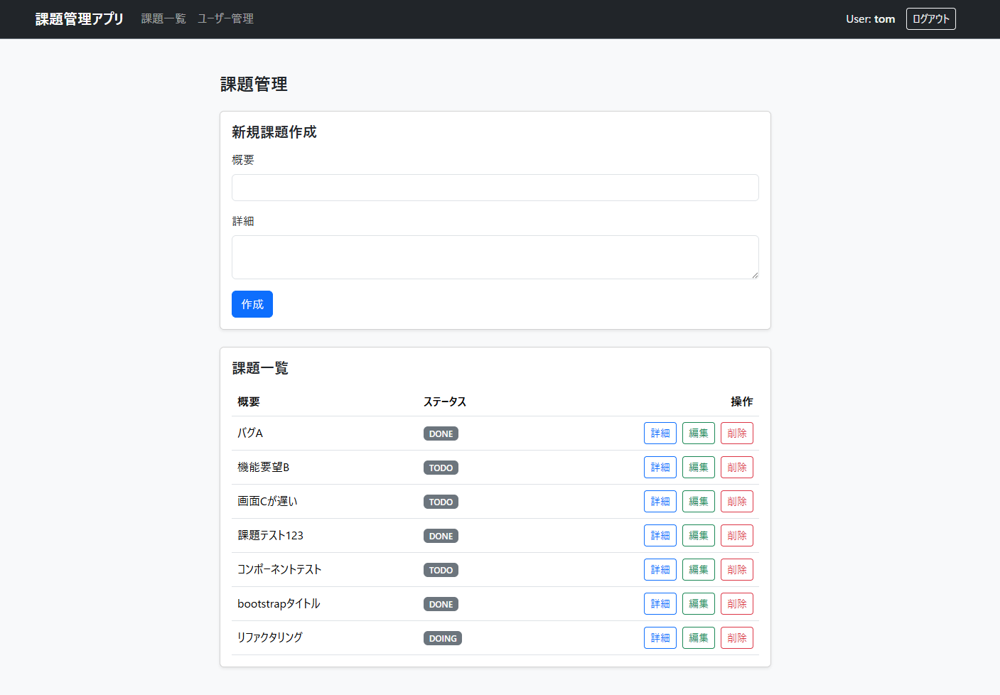

# 課題管理アプリ

React と Spring Boot で構築した課題管理アプリです。  
一般ユーザーと管理者ユーザーで適切な権限分離を行い、安全かつシンプルな進捗管理を実現しています。

---

## 画面イメージ



---

## 主要機能

- **認証・認可機能**
  - ログイン / ログアウト
  - ロールに基づくアクセス制御（`ADMIN` / `USER`）
- **課題管理機能**
  - 課題の一覧表示・詳細表示
  - 課題の新規作成
  - 課題の編集（ステータス変更：`TODO` / `DOING` / `DONE`）
  - 課題の削除（**`ADMIN` 権限のみ可能**）
- **ユーザー管理機能（`ADMIN` 権限のみアクセス・操作可能）**
  - ユーザー情報の一覧表示
  - ユーザーの新規作成
  - ユーザー情報の編集
  - ユーザーの削除

---

## こだわったポイント・設計思想

1. **実用性を考慮した権限設計**
   - 一般ユーザー（`USER`）にも課題の起票・進捗更新（編集）を許可し、日々の運用をスムーズに行えるようにしています。
   - 誤操作や不正によるデータ喪失を防ぐため、「削除」操作のみ管理者（`ADMIN`）に限定しました。
2. **堅牢な二重制御**
   - **フロントエンド (React):** ログイン中の権限（`authority`）を判定し、`USER` 権限時には課題の「削除ボタン」および「ユーザー管理画面への遷移ボタン」を UI 上で非表示化。
   - **バックエンド (Spring Boot):** UI 側の制御だけに頼らず、API 層で `@PreAuthorize("hasAuthority('ADMIN')")` を付与し、不正な直接リクエストに対しても 403 Forbidden を返す二重のセキュリティを確保。
3. **入力バリデーションの実施**
   - ユーザー名の重複防止や、10文字以上のパスワード制約などのバリデーションルールを設定し、バックエンド側でデータの整合性と安全性を確保。
4. **TypeScript による型安全な開発**
   - Props や API のレスポンス型を厳密に定義し、コンパイル時点でバグを検知できる堅牢なフロントエンド構成にしています。

---

## 技術スタック

### フロントエンド

- React 18
- TypeScript
- Vite
- Bootstrap 5

### バックエンド

- Java 21
- Spring Boot 4.1.1
- Spring Security
- MyBatis

### データベース & インフラ

- MySQL 8.0
- Docker / Docker Compose

---

## データベース構造

### `issues` テーブル（課題管理）

| カラム名      | 型           | 制約                        | 説明                                  |
| :------------ | :----------- | :-------------------------- | :------------------------------------ |
| `id`          | BIGINT       | PRIMARY KEY, AUTO_INCREMENT | ID                                    |
| `summary`     | VARCHAR(256) | NOT NULL                    | 概要                                  |
| `description` | VARCHAR(256) | NOT NULL                    | 詳細                                  |
| `status`      | VARCHAR(256) | NOT NULL                    | ステータス（`TODO`, `DOING`, `DONE`） |

### `users` テーブル（ユーザー管理）

| カラム名    | 型                   | 制約                        | デフォルト | 説明                           |
| :---------- | :------------------- | :-------------------------- | :--------- | :----------------------------- |
| `id`        | BIGINT               | PRIMARY KEY, AUTO_INCREMENT | -          | ID                             |
| `username`  | VARCHAR(50)          | NOT NULL, UNIQUE            | -          | ユーザー名                     |
| `password`  | VARCHAR(500)         | NOT NULL                    | -          | BCryptハッシュ化済みパスワード |
| `authority` | ENUM('ADMIN','USER') | NOT NULL                    | 'USER'     | 権限（`ADMIN` または `USER`）  |

---

## セットアップ・起動方法

Docker Desktop がインストールされている環境であれば、以下のコマンドのみで全環境が立ち上がります。

### 1. リポジトリのクローン

```bash
git clone https://github.com/masahiro0121/task-solving-app.git
cd task-solving-app
```

### 2. コンテナの起動

```bash
docker compose up -d
```

### 3. アプリケーションへのアクセス

ブラウザで以下の URL にアクセスしてください。

- http://localhost:5173

### 4. 動作確認用アカウント

| ユーザー名 | パスワード     | 権限    | 備考                           |
| :--------- | :------------- | :------ | :----------------------------- |
| `tom`      | `password1234` | `ADMIN` | 課題の削除・ユーザー管理が可能 |
| `bob`      | `password1234` | `USER`  | 課題の参照・作成・編集が可能   |

---

## コンテナの停止方法

```bash
docker compose down
```
